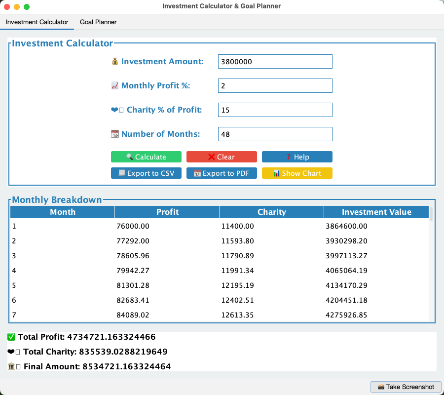

# Investment App

A comprehensive Java Swing application for investment calculations, goal planning, and financial analysis with modern UI and localization support.



## 🚀 Features

### 📊 Investment Calculator
- Calculate investment growth over time with monthly profit rates
- Charity donation tracking and calculations
- Monthly breakdown of investment performance
- Interactive charts with detailed explanations
- Export results to CSV and PDF formats

### 🎯 Goal Planner
- Plan how to reach specific monthly profit targets
- Calculate required investment duration
- Track progress towards financial goals
- Visual representation of investment journey
- Comprehensive goal achievement analysis

### 💰 One-Time Investment
- Analyze single investment scenarios
- Calculate long-term investment returns
- Charity impact assessment
- Profit rate calculations
- Investment value tracking over time

### 🎨 Modern UI/UX
- FlatLaf theming for modern appearance
- Consistent button styling and layout
- Input validation with user-friendly messages
- Tooltips for better user guidance
- Responsive design elements

### 📈 Advanced Charting
- JFreeChart integration for professional charts
- Interactive chart explanations
- Multiple chart types (stacked bars, line charts)
- Hover tooltips with detailed information
- Export chart data

### 🌍 Localization Support
- Externalized text in properties files
- Easy translation and customization
- Support for multiple languages
- Centralized text management
- No hardcoded strings

## 🛠️ Technology Stack

- **Language**: Java 17
- **UI Framework**: Java Swing with FlatLaf
- **Charts**: JFreeChart
- **Build Tool**: Maven
- **PDF Generation**: iText
- **CSV Export**: Apache Commons CSV
- **Architecture**: MVC Pattern

## 📋 Prerequisites

- Java 17 or higher
- Maven 3.6 or higher
- Git

## 🔧 Installation

1. **Clone the repository**
   ```bash
   git clone https://github.com/sajadparacha/InvestmentApp.git
   cd InvestmentApp
   ```

2. **Build the project**
   ```bash
   mvn clean compile
   ```

3. **Run the application**
   ```bash
   mvn exec:java -Dexec.mainClass="profitcalculation.MainApp"
   ```

## 🎮 Usage Guide

### Investment Calculator Tab

1. **Enter Investment Details**:
   - Investment Amount: Total amount to invest
   - Monthly Profit %: Expected monthly profit rate
   - Charity % of Profit: Percentage to donate
   - Number of Months: Investment duration

2. **Calculate Results**:
   - Click "Calculate" to see results
   - View monthly breakdown table
   - Check summary statistics

3. **Export and Visualize**:
   - Click "Show Chart" for visual representation
   - Use "Explain Chart" for detailed chart information
   - Export to CSV or PDF for record keeping

### Goal Planner Tab

1. **Set Your Goals**:
   - Target Monthly Profit: Desired monthly earnings
   - Monthly Investment: Amount you can invest monthly
   - Monthly Profit Rate: Expected profit percentage
   - Charity Rate %: Donation percentage

2. **Plan Your Journey**:
   - Calculate months required to reach goal
   - View total investment needed
   - See final investment value

3. **Track Progress**:
   - Visualize progress with charts
   - Monitor monthly profit growth
   - Export your financial plan

### One-Time Investment Tab

1. **Define Investment**:
   - Investment Amount: Single investment sum
   - Monthly Profit %: Expected monthly returns
   - Charity % of Profit: Donation percentage
   - Number of Months: Investment period

2. **Analyze Returns**:
   - Calculate total profit over period
   - Track charity contributions
   - Determine final investment value
   - Calculate overall profit rate

3. **Visualize Results**:
   - View monthly breakdown charts
   - Export detailed analysis
   - Compare different scenarios

## 📁 Project Structure

```
InvestmentApp/
├── src/
│   ├── main/
│   │   ├── java/
│   │   │   └── profitcalculation/
│   │   │       ├── controller/          # MVC Controllers
│   │   │       ├── model/              # Business Logic
│   │   │       ├── view/               # UI Components
│   │   │       ├── util/               # Utility Classes
│   │   │       └── MainApp.java        # Application Entry Point
│   │   └── resources/
│   │       ├── investment_calculator.properties
│   │       ├── goal_planner.properties
│   │       └── one_time_investment.properties
├── target/                             # Compiled Classes
├── pom.xml                            # Maven Configuration
├── README.md                          # This File
└── InvestmentApp_Architecture.md      # Technical Architecture
```

## 🔧 Configuration

### Properties Files

The application uses three main properties files for localization:

- `investment_calculator.properties`: Text for Investment Calculator tab
- `goal_planner.properties`: Text for Goal Planner tab  
- `one_time_investment.properties`: Text for One-Time Investment tab

### Customization

To customize the application:

1. **Modify Default Values**: Edit the properties files to change default input values
2. **Update Text**: Modify labels, tooltips, and messages in properties files
3. **Add Languages**: Create new properties files for different languages
4. **Customize UI**: Modify view classes for layout changes

## 🧪 Testing

### Manual Testing

1. **Input Validation**:
   - Test with invalid inputs (negative numbers, empty fields)
   - Verify error messages appear correctly
   - Test boundary conditions

2. **Calculation Accuracy**:
   - Verify calculations match expected results
   - Test with known values
   - Check charity calculations

3. **Export Functionality**:
   - Test CSV export with different data sets
   - Verify PDF generation
   - Check file naming and locations

4. **Chart Functionality**:
   - Test chart display with various data
   - Verify chart explanations
   - Test chart export

## 🐛 Troubleshooting

### Common Issues

1. **Application Won't Start**:
   - Verify Java 17+ is installed: `java -version`
   - Check Maven installation: `mvn -version`
   - Ensure all dependencies are downloaded

2. **Charts Not Displaying**:
   - Verify JFreeChart dependency in pom.xml
   - Check for graphics driver issues
   - Ensure sufficient memory allocation

3. **Export Failures**:
   - Check write permissions in target directory
   - Verify iText dependency for PDF export
   - Ensure Apache Commons CSV dependency

4. **Unicode Display Issues**:
   - Properties files use UTF-8 encoding
   - Avoid special Unicode characters
   - Use ASCII-compatible text

### Performance Optimization

- Close unused tabs to reduce memory usage
- Limit chart data points for large datasets
- Use appropriate JVM memory settings

## 🤝 Contributing

1. Fork the repository
2. Create a feature branch: `git checkout -b feature/new-feature`
3. Make your changes
4. Test thoroughly
5. Commit with descriptive messages
6. Push to your branch
7. Create a Pull Request

### Development Guidelines

- Follow MVC architecture pattern
- Use properties files for all user-facing text
- Add comprehensive error handling
- Include input validation
- Write clear commit messages
- Update documentation for new features

## 📄 License

This project is licensed under the MIT License - see the LICENSE file for details.

## 👨‍💻 Author

**Sajad Paracha**
- GitHub: [@sajadparacha](https://github.com/sajadparacha)
- Repository: [InvestmentApp](https://github.com/sajadparacha/InvestmentApp)

## 🙏 Acknowledgments

- **FlatLaf**: Modern look and feel for Java Swing
- **JFreeChart**: Professional charting library
- **iText**: PDF generation capabilities
- **Apache Commons**: CSV export functionality
- **Maven**: Build and dependency management

## 📞 Support

For support and questions:
- Create an issue on GitHub
- Check the troubleshooting section
- Review the architecture documentation
- Contact the maintainer

## 🔄 Version History

### v1.0.0 (Current)
- Complete UI overhaul with FlatLaf theming
- Localization system implementation
- One-Time Investment tab addition
- Enhanced chart functionality
- Export capabilities (CSV/PDF)
- Comprehensive help system
- Input validation and error handling
- Modern button styling and layout

---

**Happy Investing!** 